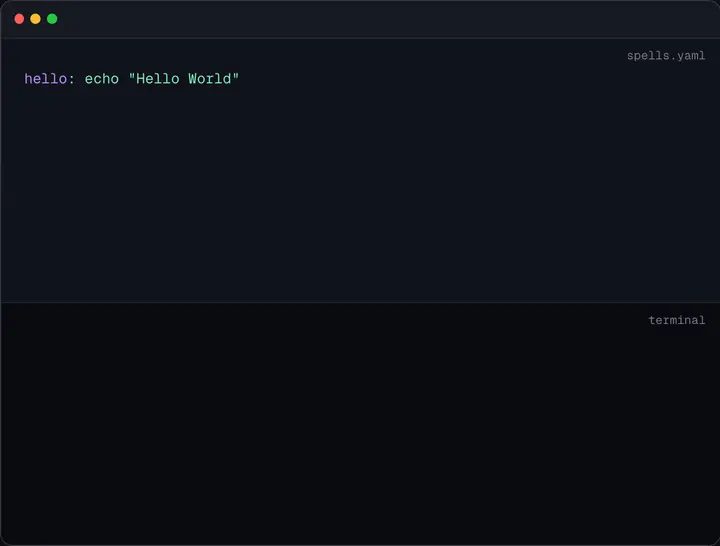

<p align="center">
  <a href="https://nikoro.github.io/spellbook/">
    
  </a>
</p>

<p align="center">
  <strong>Cast commands like spells. No prefix:</strong>
</p>

<p align="center">
  ❌ <code>make hello</code><br />
  ❌ <code>just hello</code><br />
  ❌ <code>npm run hello</code><br />
  ❌ <code>task hello</code><br />
  ❌ <code>./scripts/hello.sh</code><br />
  ✅ <code>hello</code>
</p>

<p align="center">
  <a href="https://github.com/Nikoro/spellbook/releases/latest"></a>
  <a href="https://github.com/Nikoro/spellbook"></a>
  <!-- Keep Swift version in sync with swift-tools-version in Package.swift -->
  <a href="https://github.com/Nikoro/spellbook"></a>
  <a href="https://opensource.org/licenses/MIT">
    
  </a>
</p>

---

Define commands in a `spells.yaml` file, run `spells` to activate, then use them like any shell command — no `make`, `just`, or `npm run` prefix.

<p align="center">
  
</p>

## Install

### Curl (recommended)

```sh
curl -sSfL https://raw.githubusercontent.com/Nikoro/spellbook/main/install.sh | sh
```

### Manual

Download the binary for your architecture from [GitHub Releases](https://github.com/Nikoro/spellbook/releases), place it in your PATH, then add shell integration:

```sh
# zsh or bash
eval "$(spells init zsh)"

# fish
spells init fish | source
```

> macOS only (Apple Silicon). Intel and Linux are not supported.

## Quick Start

```sh
spells create         # creates spells.yaml
# edit spells.yaml
spells                # activates wrappers in ~/.spellbook/bin
```

Wrappers are immediately available in new shell sessions. To use them in the current session, restart your shell or source your rc file.

Full walkthrough: **[nikoro.github.io/spellbook/docs/getting-started](https://nikoro.github.io/spellbook/docs/getting-started/)**.

## Manifest Format

Spellbook supports two modes.

### Canonical mode

Use `spells:` for definitions and top-level keys for metadata:

```yaml
extends: ../shared
spells:
  hello:
    script: echo "Hello"
```

### Compact mode

Every top-level key is a spell:

```yaml
hello:
  script: echo "Hello"
```

Use canonical mode when you need `extends:` or `version:`.

### Scalar shorthand

```yaml
hello: echo "Hello"
```

Equivalent to `hello:` with `script: echo "Hello"`.

## Params

`params:` is always a **map** (each entry is `name: <body>`), never a YAML list. List-style entries are rejected at parse time.

### Positional (inferred)

```yaml
spells:
  greet:
    script: echo "Hello, {{name}}"
    params:
      name:
```

```sh
$ greet World    # Hello, World
```

A bare key with no body marks a required positional param.

### Named flags

```yaml
spells:
  greet:
    script: echo "Hello, {{name}}"
    params:
      name:
        flags: -n, --name
        default: World
```

```sh
$ greet --name Alice   # Hello, Alice
$ greet                # Hello, World
```

### Types

Params support `string` (default), `int`, `double`, `number`, `bool`, and `enum` types.

```yaml
params:
  count:
    type: int
  verbose:
    type: bool
  env:
    values: [dev, staging, prod]
```

- Missing required params are errors.
- Missing optional params use the type's zero value or their declared default.
- Enum values are matched case-insensitively and canonicalized.
- Bool flags toggle when present without a value.

### Explicit mode

Group params under `required:` and `optional:` for explicit control:

```yaml
params:
  required:
    name:
  optional:
    greeting:
      default: Hello
```

## Switches

Define mutually exclusive command branches:

```yaml
spells:
  deploy:
    switch:
      staging:
        script: ./deploy.sh staging
      production:
        script: ./deploy.sh production
    default: staging
```

```sh
$ deploy             # ./deploy.sh staging (default)
$ deploy production  # ./deploy.sh production
```

- `default:` can reference a switch key or be an inline command.
- Without a default, TTY invocations show an interactive picker; non-TTY invocations error with options listed.
- Switch branches can have their own params, nested switches, aliases, and runtime fields.
- Switch aliases are extra names for the same branch.

## Extends

Share spells across projects with `extends:`:

```yaml
extends: ../shared
spells:
  local-only:
    script: echo "just this project"
```

- Closer manifests win by whole-spell override.
- Chains are supported: a parent can extend its own parent.
- `extends: ~` pulls from `~/spells.yaml` (home fallback).
- Cycles are detected and reported with the full chain.

Without `extends:`, Spellbook checks `~/spells.yaml` as a global fallback when no project manifest is found.

## Overrides

Wrap existing PATH commands safely:

```yaml
spells:
  cat:
    override: true
    script: {{cat}} -n ...args
```

```sh
$ cat file.txt    # runs /usr/bin/cat -n file.txt
```

- `override: true` is required to shadow a PATH binary.
- `{{spell-name}}` resolves to the original external command.
- Shell builtins (`cd`, `export`, etc.) cannot be overridden.
- Aliases cannot shadow PATH binaries.

## Passthrough Args

Forward extra arguments with `...args`:

```yaml
spells:
  test:
    script: swift test ...args
```

```sh
$ test --filter MyTest --verbose
# swift test --filter MyTest --verbose
```

Use `--` to stop Spellbook from parsing further arguments:

```sh
$ test -- --some-flag
```

All values are shell-escaped by default.

## Aliases

```yaml
spells:
  test:
    aliases: [t, check]
    script: swift test
```

Both `t` and `check` generate wrappers that invoke the `test` spell. Help for an alias shows canonical help with an "alias for" note.

## Runtime Fields

Per-spell configuration:

| Field | Effect |
|-------|--------|
| `working_dir: ./sub` | Run script from a relative directory |
| `shell: zsh` | Use a specific shell instead of bash |
| `silent: true` | Show spinner, hide output on success, flush on failure |
| `description:` | Shown in `spells list --verbose` and help |

Runtime fields inherit down switch trees and can be overridden at any level.

## Shell Integration

```sh
spells init zsh    # prints PATH setup for zsh
spells init bash   # prints PATH setup for bash
spells init fish   # prints PATH setup for fish
```

Add to your shell config:

```sh
# zsh (~/.zshrc) or bash (~/.bashrc)
eval "$(spells init zsh)"

# fish (~/.config/fish/config.fish)
spells init fish | source
```

On first activation, Spellbook offers to set this up automatically.

## Commands

| Command | Description |
|---------|-------------|
| `spells` | Activate the current project |
| `spells list` | List available spells (adds `[override]` marker for override spells) |
| `spells list --verbose` | List spells with details |
| `spells diff` | Show added/changed/removed spells since last activation |
| `spells doctor` | Check for common issues |
| `spells doctor --fix` | Re-activate to resolve state/wrapper drift |
| `spells clean <name>` | Remove a single wrapper + its state entry |
| `spells clean --orphans` | Remove wrappers whose spells no longer exist in the manifest |
| `spells clean --all` | Remove every wrapper and clear this project's state |
| `spells create` | Create a new `spells.yaml` |
| `spells create <name>` | Create with a custom spell name |
| `spells init <shell>` | Print shell integration (PATH + wrapper-level TAB completion) |
| `spells completion <shell>` | Print completion script for the `spells` keyword itself |
| `spells help <spell>` | Show spell help |
| `spells --version` | Show version |

## Wrapper-level TAB completion

After `eval "$(spells init zsh)"` (or the equivalent for bash 5.x / fish) every activated wrapper gets dynamic TAB completion driven by the Spellbook picker:

- `sbdeploy <TAB>` opens the Spellbook picker with the required-slot candidates; type characters to fuzzy-filter, arrows or `j/k` to navigate, Enter to accept, ESC to cancel.
- `sbdeploy st<TAB>` auto-fills to `sbdeploy staging` when only one candidate matches.
- `sbtest --env <TAB>` offers the declared enum values for the `--env` flag.
- `hello<TAB>` with no remaining grammar falls through to the shell's native file completion.
- Everything is driven by a single hidden oracle, `spells complete <wrapper> --cword N -- <tokens>`, backed by a best-effort binary manifest cache under `$SPELLBOOK_HOME/state/<sha256>/manifest.bin`.
